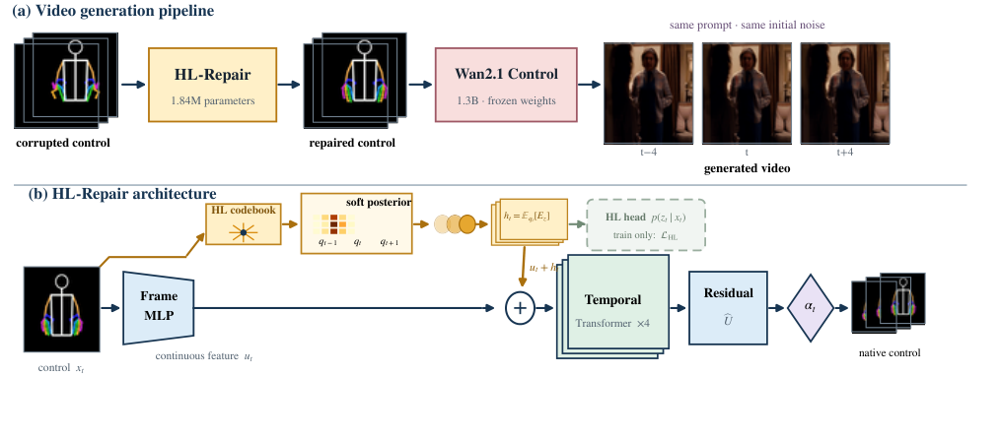

# HL-Repair

Official implementation of **Temporal Hand Labanotation Priors for Robust
Control of Frozen Video Diffusion**.

HL-Repair restores noisy 17-frame hand trajectories before they enter a frozen
video generator. It combines continuous bone directions with locally pooled,
soft Hand Labanotation (HL) posteriors. Wan2.1-Fun-Control is never fine-tuned.



## Highlights

- Drop-in tracker-side repair; the downstream video model stays frozen.
- Compact 1.84M-parameter deployment model.
- CPU, CUDA, and Ascend-compatible PyTorch implementation.
- Released STB checkpoint and machine-readable paper results.
- Fixed seeds, splits, corruption schedule, hashes, and CI smoke tests.

On 1,000 matched Wan generations, HL-Repair raises same-seed clean-output SSIM
from .713 to .884 and exceeds centered median-9 by .035. See the
[paper](paper/HL_Repair.pdf) and [Wan protocol](WAN.md) for scope and caveats.

## Installation

Python 3.10 or newer is required.

```bash
cd HL-Repair
python -m venv .venv
source .venv/bin/activate
pip install -U pip
pip install -e '.[test]'
pytest -q
```

`requirements-lock.txt` records the versions used for the CPU release
verification. Install the platform-specific PyTorch build first when using
CUDA or Ascend.

For CUDA, install the matching PyTorch wheel before `pip install -e .`. For Ascend, install the
matching CANN and torch-npu releases; torch-npu is imported only when an
`npu:*` device is requested.

## Quick inference

The input is a NumPy array of normalized local bone directions with shape
`[17, 20, 3]` or `[N, 17, 20, 3]`:

```bash
hlrepair-infer input.npy repaired.npy \
  --checkpoint checkpoints/hl_repair_stb.pt \
  --device cpu
```

The default 3.75-degree confidence-free gate bypasses already trustworthy
windows. To use the Python API:

```python
import torch
from hlrepair import load_checkpoint
from hlrepair.model import gated_repair

model = load_checkpoint("checkpoints/hl_repair_stb.pt", "cpu")
x = torch.randn(1, 17, 20, 3)
x = x / x.norm(dim=-1, keepdim=True)
with torch.inference_mode():
    repaired, hl_logits, triggered = gated_repair(model, x)
```

## STB evaluation

Obtain the Stereo Hand Pose Tracking Benchmark annotations from its official
distribution and place the COCO-style files as follows (the dataset is not
redistributed here):

```text
data/STB.annotations/
├── STB_train.json
└── STB_test.json
```

Verify their hashes against [REPRODUCIBILITY.md](REPRODUCIBILITY.md), then run:

```bash
hlrepair-eval \
  --annotations data/STB.annotations/STB_test.json \
  --checkpoint checkpoints/hl_repair_stb.pt \
  --output outputs/evaluation.json \
  --device cpu
```

This recreates the fixed B1 corruption and reports corrupted, median-9, and
HL-Repair trajectory metrics.

## Training

The following reproduces the paper's seed-2801 model:

```bash
hlrepair-train \
  --train-annotations data/STB.annotations/STB_train.json \
  --test-annotations data/STB.annotations/STB_test.json \
  --device cuda \
  --output outputs/hl_repair_seed2801.pt \
  --report outputs/train_seed2801.json
```

Use `DEVICE=npu:0 bash scripts/reproduce_stb.sh data/STB.annotations` for the
original accelerator family. Full settings are recorded in
`configs/paper.yaml`; the CLI defaults intentionally match that file.

## Repository layout

```text
src/hlrepair/       model, geometry, data, training, evaluation, inference
checkpoints/        released seed-2801 checkpoint
configs/            locked paper configuration
results/            machine-readable aggregate paper results
scripts/            one-command reproduction and smoke test
tests/              CPU unit and checkpoint tests
paper/              manuscript PDF
```

## Reproducibility boundary

The STB experiment is directly reproducible from public annotations. The
frozen-Wan study additionally requires separately licensed Wan weights,
VideoX-Fun, DWPose, and substantial accelerator time; therefore this repository
ships its complete aggregate report and exact hashes, but not third-party
weights or 1,000 generated videos. See [REPRODUCIBILITY.md](REPRODUCIBILITY.md)
and [WAN.md](WAN.md).

## Citation

```bibtex
@misc{lu2027hlrepair,
  title={Temporal Hand Labanotation Priors for Robust Control of Frozen Video Diffusion},
  author={Lu, Haotian and Zhang, Xiaoping},
  year={2027},
  note={Manuscript}
}
```

## License

Code is released under the [MIT License](LICENSE). STB, Wan, VideoX-Fun,
SmoothNet, DWPose, and LPIPS remain subject to their respective licenses.
